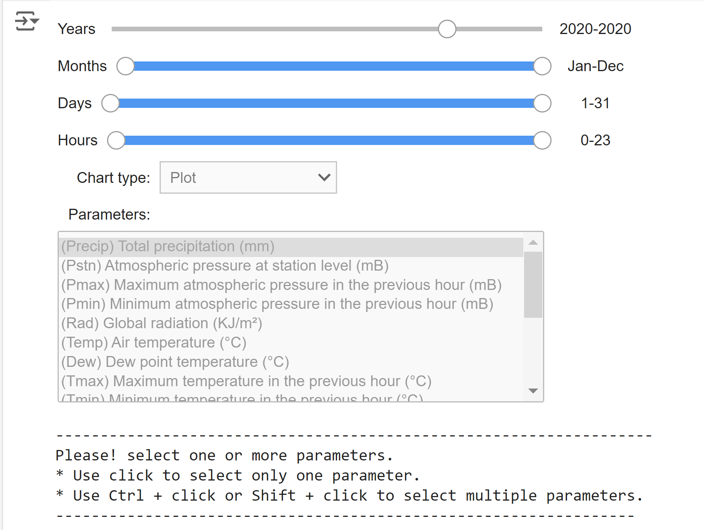
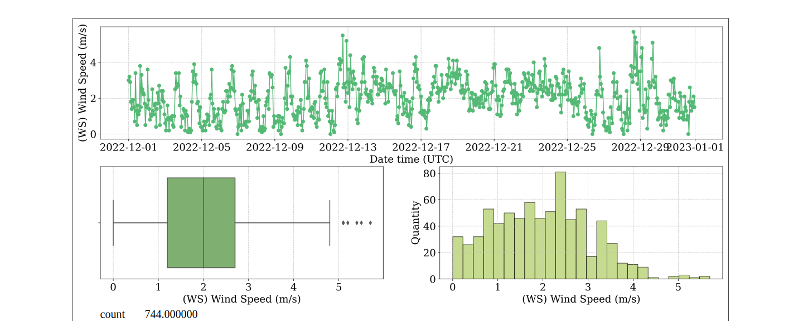

# INMET data tool
   

This Python-based tool was designed to simplify the exploratory analysis of meteorological time series data. The interactive graphical interface allows users to perform complex analyses easily and efficiently.

## Key Features

- **Intuitive Graphical Interface**: Easily navigate and interact with INMET meteorological data using a user-friendly graphical interface. Utilize the interactive user interface to filter, manipulate, and visualize your data in real-time.
- **Exploratory Analysis**: Perform detailed exploratory analyses of time series with just a few clicks.
- **Data Visualization**: Create dynamic charts and visualizations to gain a better understanding of data trends and patterns.

## Requirements

- Python 3.6 or higher
- Python Libraries:
  - Pandas
  - Numpy   
  - Matplotlib
  - Seaborn
  - IPyWidgets

> **NOTE:**
> The notebook file (`INMETDataTool.ipynb`) can be executed using different platforms for running notebooks, such as Jupyter Notebook and Google Colab.
>- **Jupyter Notebook**: Run the notebook on your machine with the support of a web application.
>- **Google Colab**: Execute your notebook in Google Cloud.
  
 

 

  <em>Visualize your data in real time</em>

