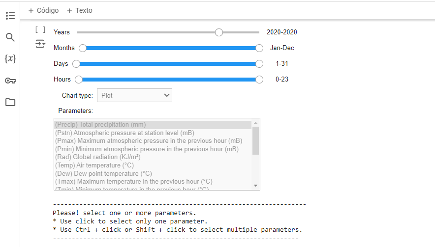

# INMET data tool
   

This Python-based tool designed to simplify the exploratory analysis of meteorological time series data. With an interactive graphical interface, the tool allows users to perform complex analyses easily and efficiently.

## Key Features

- **Intuitive Graphical Interface**: Navigate and interact with INMET meteorological data through a user-friendly graphical interface. Utilize interactive user interface to filter, manipulate, and visualize your data in real-time.
- **Exploratory Analysis**: Conduct detailed exploratory analyses of time series with just a few clicks.
- **Data Visualization**: Generate dynamic charts and visualizations to better understand trends and patterns in the data.
 

 

  <em>Visualize your data in real time</em>

---
> **NOTE:** Launching soon!
> We are excited to announce that INMET data tool will be launching soon! 
